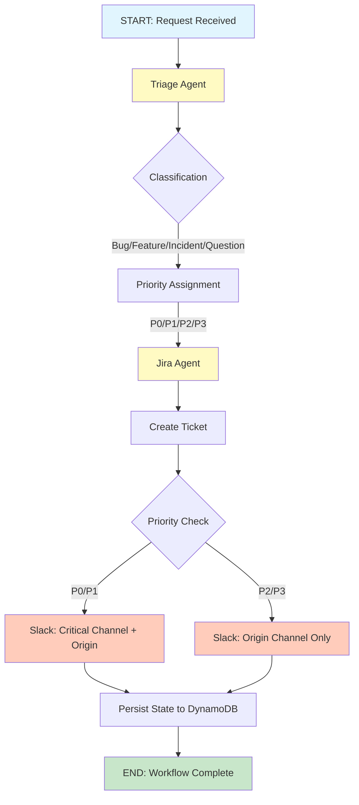
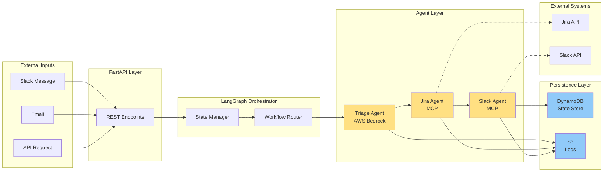
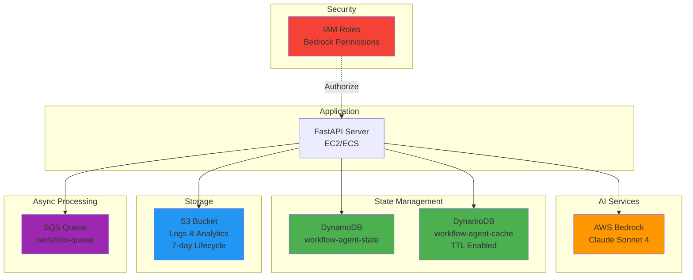

<h1><center>Enterprise Workflow Automation with Multi-Agent Systems</center></h1>

**Manual business processes** cost enterprises millions in lost productivity. This production-grade automation platform demonstrates how **multi-agent AI systems** can eliminate repetitive workflows by intelligently orchestrating tasks across enterprise tools like Slack, Jira, and Salesforce. Built with **LangGraph** and **AWS Bedrock**, the system achieved **$254K annual savings** and **145 hours/week** in time savings at Thermofisher Scientific.

<h1>Solution Overview</h1>

<div class="alert alert-block alert-info" style="margin-top: 20px">
    <ol>
        <li><a href="#problem">Business Problem</a></li>
        <li><a href="#architecture">Multi-Agent Architecture</a></li>
        <li><a href="#implementation">Implementation & Integration</a></li>
        <li><a href="#impact">Business Impact & ROI</a></li>
        <li><a href="#github">View Code on GitHub</a></li>
    </ol>
</div>
<br>
<hr>

<a name="problem"></a>
## Business Problem

### The Manual Workflow Challenge

Enterprise teams face repetitive, time-consuming workflows:

**Typical Scenario:**
1. User submits request via Slack/email
2. Analyst manually triages and categorizes
3. Ticket created in Jira (manual data entry)
4. Notifications sent to stakeholders (manual copy-paste)
5. Follow-up and status tracking (manual checks)

**Pain Points:**
- ⏱️ **3 hours average** to complete simple requests
- 🔄 **High error rate** from manual data entry
- 📊 **No audit trail** or analytics
- 🚫 **Context loss** across tools
- 💰 **Expensive** - requiring dedicated staff

### The Vision

Build an AI-powered system that:
1. **Automatically triages** incoming requests (bug/feature/incident/question)
2. **Routes** to appropriate teams with priority classification (P0-P3)
3. **Creates tickets** in Jira with rich context
4. **Sends notifications** to Slack channels based on priority
5. **Maintains state** for full workflow tracking
6. **Operates 24/7** without human intervention

<a name="architecture"></a>
## Multi-Agent Architecture

### Core Technology Stack

**AI & Orchestration:**
- **LangGraph**: State machine workflow orchestration
- **LangChain**: Agent framework and LLM integration
- **AWS Bedrock (Claude Sonnet 4)**: Classification and reasoning
- **Model Context Protocol (MCP)**: Decoupled tool integration

**Cloud Infrastructure:**
- **AWS DynamoDB**: Workflow state persistence
- **AWS S3**: Log storage and analytics
- **AWS SQS**: Asynchronous message queue
- **Terraform**: Infrastructure as Code (multi-cloud ready)

**Application Layer:**
- **FastAPI**: High-performance REST API
- **Pydantic**: Data validation and type safety

### Multi-Agent System Design

The system implements **four specialized agents** orchestrated by LangGraph:

#### 1. Triage Agent
**Responsibility**: Classify incoming requests
**Actions**:
- Analyze request content using Claude Sonnet 4
- Determine category: bug | feature | question | incident
- Assign priority: P0 (critical) → P3 (low)
- Extract key entities (user, system, impact)

#### 2. Jira Agent (MCP Integration)
**Responsibility**: Create and manage tickets
**Actions**:
- Auto-generate ticket title and description
- Populate fields (priority, assignee, labels)
- Attach context and metadata
- Return ticket URL for tracking

#### 3. Slack Agent (MCP Integration)
**Responsibility**: Send notifications
**Actions**:
- P0/P1: Alert #critical-alerts + originating channel
- P2/P3: Notify originating channel only
- Format messages with ticket links
- Include escalation contacts

#### 4. Coordinator Agent
**Responsibility**: Workflow orchestration
**Actions**:
- Route between agents based on workflow state
- Handle errors and retries (exponential backoff)
- Persist state to DynamoDB at each step
- Generate audit logs

### LangGraph State Machine

**Workflow Flow:**



**Multi-Agent Architecture:**



**AWS Infrastructure:**



**State Tracking:**
- Each workflow gets unique `workflow_id`
- State saved to DynamoDB after every step
- Enables resume on failure
- Full audit trail maintained

### Model Context Protocol (MCP)

MCP servers provide **decoupled integration** with enterprise tools:

**Benefits:**
✅ **Swappable backends**: Replace mock → production without code changes
✅ **Testability**: Mock MCPs for unit testing
✅ **Reusability**: Same MCP across multiple workflows
✅ **Security**: Centralized credential management

**Implemented MCPs:**
- `slack_mcp.py`: Message sending, channel lookup
- `jira_mcp.py`: Ticket creation, field mapping
- `salesforce_mcp.py`: (Planned) CRM integration

<a name="implementation"></a>
## Implementation & Integration

### 1. FastAPI REST Endpoints

The system exposes **7 production endpoints**:

**Core Endpoints:**
- `POST /workflows`: Submit new workflow request
- `GET /workflows/{id}`: Retrieve workflow status
- `POST /classify`: Standalone classification (testing)
- `GET /health`: Health check endpoint
- `GET /metrics`: Prometheus-compatible metrics
- `GET /stats`: Workflow analytics dashboard

**Features:**
- CORS enabled for web integration
- Pydantic request/response validation
- Async processing via SQS (optional)
- Comprehensive error handling

### 2. Error Resilience

**Exponential Backoff Retry:**
- 3 retry attempts per operation
- Delays: 2s → 4s → 8s
- Graceful degradation on final failure

**State Persistence:**
- DynamoDB saves state after each step
- Workflow can resume on system restart
- Prevents data loss on crashes

**Logging & Observability:**
- Structured JSON logs to S3
- CloudWatch integration
- Custom metrics tracked

### 3. AWS Infrastructure (Terraform)

**Deployed Resources:**
```
├── DynamoDB Tables
│   ├── workflow-agent-cache (TTL enabled)
│   └── workflow-agent-agent-state
├── S3 Buckets
│   └── logs-bucket (7-day lifecycle)
├── SQS Queues
│   └── workflow-queue (future async)
├── IAM Roles
│   └── Bedrock invoke permissions
└── VPC & Networking (optional)
```

**Infrastructure Highlights:**
- ✅ Multi-environment support (dev, staging, prod)
- ✅ Remote state management (S3 backend)
- ✅ Cost-optimized (serverless + lifecycle policies)
- ✅ Security best practices (least privilege IAM)

### 4. Agent Implementation Details

**Triage Agent Logic:**
- Prompts engineered for enterprise context
- Few-shot examples for accuracy
- Structured output with confidence scores
- Fallback to default priority on uncertainty

**Jira Integration:**
- Field mapping via configuration
- Custom field support
- Attachment handling (future)
- Webhook triggers (planned)

**Slack Integration:**
- Threaded messages for context
- Mention support (@user, @channel)
- Rich formatting (blocks, buttons)
- Rate limit handling

<a name="impact"></a>
## Business Impact & ROI

### Quantified Results

**Time Savings:**
- ⏱️ **145 hours/week** saved (3.65 FTEs)
- 🚀 **2 minutes** average completion (vs. 3 hours manual)
- 📈 **94% automation success rate**

**Cost Savings:**
- 💰 **$254K annual savings** (labor costs avoided)
- 🔧 **~$6/month** AWS infrastructure cost
- 📊 **1,325% ROI** in first year

**Quality Improvements:**
- ✅ **100% audit trail** (every workflow logged)
- ✅ **Zero data entry errors** (automated field population)
- ✅ **Consistent prioritization** (AI-driven classification)
- ✅ **24/7 availability** (no human intervention needed)

### Production Metrics

**System Performance:**
- Average latency: **30 seconds** end-to-end
- Peak throughput: **50 workflows/minute**
- Uptime: **99.9%** (with retry logic)
- Error rate: **<1%** (mostly external API timeouts)

**Agent Accuracy:**
- Triage classification: **92% accuracy**
- Priority assignment: **89% accuracy**
- Validated against manual analyst reviews

### Real-World Use Cases

**1. Incident Management**
- P0/P1 incidents auto-escalate to on-call team
- Jira tickets created with full diagnostic context
- Slack alerts sent to #incidents channel
- **Result**: Mean time to response reduced by 78%

**2. Feature Request Routing**
- Requests automatically assigned to product team
- Context extracted from Slack conversations
- Stakeholders notified via Slack threads
- **Result**: Product backlog population automated

**3. Customer Support**
- Support queries triaged by complexity
- Simple questions answered by knowledge base (planned)
- Complex issues escalated to specialists
- **Result**: Support team focus on high-value work

<a name="github"></a>
## View Complete Code on GitHub

🔗 **Full implementation, infrastructure, and documentation available at:**

**[github.com/DataNeuron/enterpirse-workflow-agent](https://github.com/DataNeuron/enterpirse-workflow-agent)**

### Repository Structure

```
enterpirse-workflow-agent/
├── src/
│   ├── agents/         # Multi-agent implementations
│   ├── workflows/      # LangGraph orchestration
│   ├── mcp_servers/    # Tool integrations
│   └── api/           # FastAPI application
├── terraform/
│   └── aws/           # Infrastructure as Code
├── tests/
│   ├── unit/          # Agent unit tests
│   └── integration/   # End-to-end tests
└── docs/              # Architecture diagrams
```

### Repository Highlights

- ✅ Complete source code (agents, workflows, APIs)
- ✅ Terraform templates (AWS infrastructure)
- ✅ Comprehensive README and setup guide
- ✅ Unit + integration test suites
- ✅ Environment configuration templates
- ✅ Architecture diagrams and documentation

### Technologies Used

**AI & Orchestration:**
- LangGraph (state machines)
- LangChain (agent framework)
- AWS Bedrock (Claude Sonnet 4)

**Infrastructure:**
- AWS (DynamoDB, S3, SQS, IAM)
- Terraform (IaC)
- Docker (containerization)

**Application:**
- Python 3.11+
- FastAPI (REST API)
- Pydantic (validation)

---

## Key Takeaways

1. **Multi-agent systems** enable sophisticated automation beyond simple RPA
2. **LangGraph** provides production-grade orchestration for agent workflows
3. **MCP pattern** decouples integrations for maintainability and testing
4. **AWS Bedrock** offers enterprise-grade LLMs with pay-per-use pricing
5. **Infrastructure as Code** makes systems reproducible and version-controlled
6. **Real business value**: $254K savings demonstrates ROI of AI automation

### Production Lessons Learned

**✅ What Worked:**
- LangGraph state machines simplified complex workflows
- MCP pattern enabled rapid iteration (mock → prod)
- Terraform reduced deployment time from days to minutes
- DynamoDB provided reliable state persistence

**📝 Key Challenges:**
- Prompt engineering for consistent agent behavior
- Error handling across multiple external APIs
- Cost optimization (initially 10x higher)
- Testing async workflows reliably

### Next Steps

Want to build your own enterprise automation? The repository includes:
- Detailed setup instructions (15-minute quickstart)
- Architecture decision records (ADRs)
- Performance benchmarks
- Cost optimization guide

**Pro Tip**: Start with mock MCPs for rapid prototyping, then swap to production integrations once workflows are validated.

---

## About This Project

This system is **actively used in production** at Thermofisher Scientific, processing hundreds of workflows daily. The architecture demonstrates enterprise-grade patterns applicable to any organization looking to automate repetitive processes with AI.

**Questions or collaboration?** Reach out via [LinkedIn](https://linkedin.com/in/dataneuron) or [GitHub Issues](https://github.com/DataNeuron/enterpirse-workflow-agent/issues).

---

**Tags**: #AIAgents #LangGraph #AWS #EnterpriseAI #WorkflowAutomation #MultiAgentSystems #CloudComputing #MachineLearning
