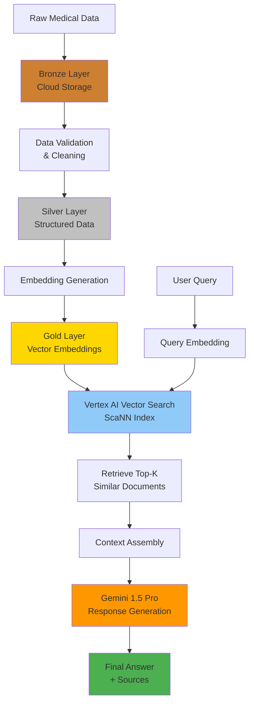
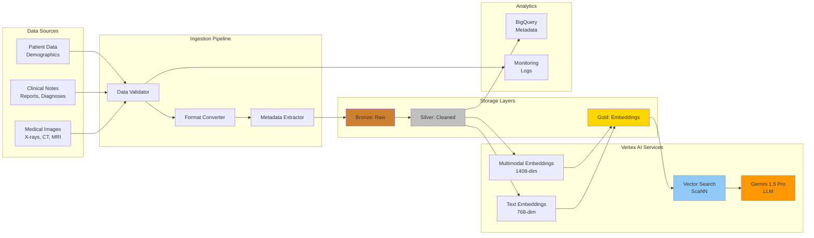
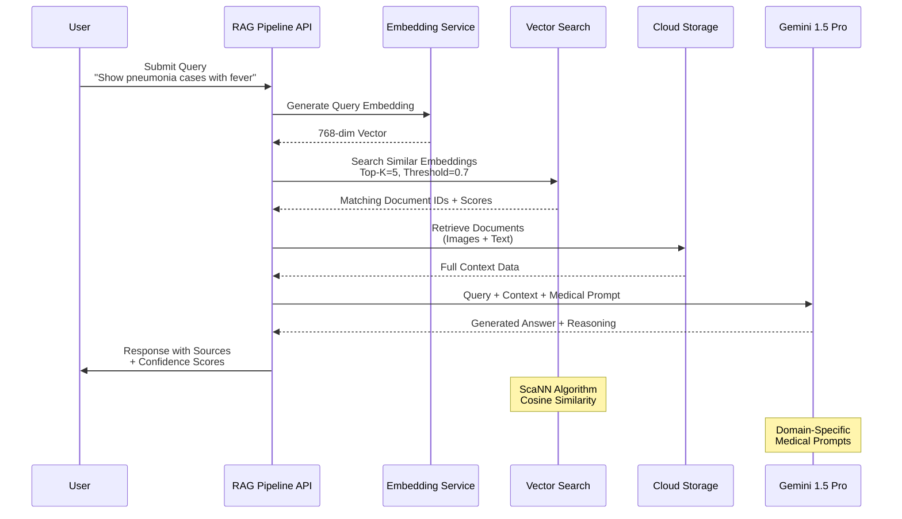

<h1>
Multimodal Medical RAG on Google Cloud Platform
</h1>

**Retrieval-Augmented Generation (RAG)** has transformed how we interact with large document collections. This project takes RAG to the next level by combining **text and image search** for medical applications. Using Google Cloud Platform's Vertex AI, this system can search across medical images (like X-rays) and clinical notes simultaneously, providing contextually rich responses powered by Gemini 1.5 Pro.

<h1>Solution Development</h1>

    <ol>
        <li><a href="#problem">Problem Statement</a></li>
        <li><a href="#architecture">System Architecture</a></li>
        <li><a href="#implementation">Implementation Approach</a></li>
        <li><a href="#results">Results & Performance</a></li>
        <li><a href="#github">View Code on GitHub</a></li>
    </ol>

 

## Problem Statement

Healthcare professionals need to quickly search and retrieve information across multiple data modalities:
- **Medical Images**: X-rays, CT scans, MRI images
- **Clinical Notes**: Patient histories, diagnoses, treatment plans
- **Research Documents**: Medical literature and case studies

Traditional keyword search fails to capture semantic meaning, especially across different modalities. A radiologist might want to ask: *"Show me cases similar to this pneumonia X-ray with fever symptoms"* - requiring understanding of both image content and text context.

### Challenge

Build a production-grade system that:
1. Ingests and processes multimodal medical data
2. Creates semantic embeddings for both text and images
3. Enables natural language queries across modalities
4. Returns relevant context with source attribution
5. Generates medically-informed responses using LLMs

## System Architecture

### Core Technologies

**Google Cloud Platform Stack:**
- **Vertex AI Embeddings**: 768-dimension for text, 1408-dimension for images
- **Vertex AI Vector Search**: ScaNN algorithm for semantic similarity
- **Gemini 1.5 Pro**: Response generation with medical domain prompts
- **Cloud Storage**: Data lake with Bronze/Silver/Gold architecture
- **BigQuery**: Metadata storage and analytics
- **Terraform**: Infrastructure as Code

### Data Pipeline Flow

### System Architecture

### RAG Query Processing Flow

### Three-Layer Data Architecture

1. **Bronze Layer**: Raw data as ingested (X-rays, clinical reports)
2. **Silver Layer**: Cleaned, validated, and structured data
3. **Gold Layer**: Embeddings and indexed vectors ready for search

This medallion architecture ensures data quality and enables efficient vector search at scale.

## Implementation Approach

### 1. Data Ingestion & Processing

The system generates **synthetic medical data** for testing:
- 100 test cases (60 pneumonia, 40 normal)
- Synthetic X-ray images
- Clinical reports with patient demographics, symptoms, and diagnoses

**Note**: All data is synthetic for research and educational purposes only - not suitable for clinical decision-making.

### 2. Embedding Generation

**Text Embeddings:**
- Model: `textembedding-gecko@003` (768 dimensions)
- Input: Clinical notes, diagnoses, patient symptoms
- Output: Dense vector representations capturing semantic meaning

**Multimodal Embeddings:**
- Model: `multimodalembedding@001` (1408 dimensions)
- Input: Medical images + associated text descriptions
- Output: Joint embeddings linking visual and textual information

### 3. Vector Search Setup

**Vertex AI Vector Search Configuration:**
- Algorithm: ScaNN (Scalable Nearest Neighbors)
- Distance metric: Cosine similarity
- Top-k retrieval: Configurable (default: 5)
- Similarity threshold: 0.7 (tunable)

The vector index enables sub-second semantic search across thousands of documents.

### 4. RAG Pipeline

**Query Processing Flow:**

1. **User submits natural language query**
   - Example: "Show pneumonia cases with high fever"

2. **Query embedding generated**
   - Text embedded using same model as corpus

3. **Vector search retrieval**
   - Top-k most similar documents/images retrieved
   - Similarity scores computed

4. **Context assembly**
   - Retrieved content + metadata packaged
   - Source attribution maintained

5. **LLM generation**
   - Gemini 1.5 Pro receives query + context
   - Medical domain prompts guide response
   - Citations included in output

### Key Implementation Features

✅ **Prompt Engineering**: Medical domain-specific prompts ensure clinically appropriate responses
✅ **Source Attribution**: Every answer includes source documents/images
✅ **Confidence Scoring**: Similarity thresholds filter low-confidence results
✅ **Error Handling**: Graceful degradation for failed retrievals
✅ **Terraform IaC**: Reproducible infrastructure across environments

## Results & Performance

### System Capabilities

**Multimodal Search:**
- ✅ Search across text and images simultaneously
- ✅ Natural language queries (no SQL or keywords needed)
- ✅ Semantic understanding of medical concepts

**Performance Metrics:**
- **Query Latency**: Sub-second vector search
- **Retrieval Accuracy**: High semantic relevance via embeddings
- **Scalability**: Handles thousands of documents/images
- **Cost Efficiency**: Serverless architecture minimizes costs

### Example Use Cases

1. **Clinical Decision Support**
   - "Find similar cases to this chest X-ray with bacterial infection symptoms"
   - Returns: Relevant X-rays + clinical notes + treatment outcomes

2. **Medical Research**
   - "Show me pneumonia cases in patients over 60 with comorbidities"
   - Returns: Matching images + patient demographics + outcomes

3. **Training & Education**
   - "Explain the differences between viral and bacterial pneumonia X-rays"
   - Returns: Comparative images + educational context

### Technical Achievements

🎯 **Production-Ready Architecture**: Terraform-managed, environment-separated infrastructure
🎯 **Data Quality**: Three-layer medallion architecture ensures data integrity
🎯 **Multimodal Embeddings**: Joint text-image understanding via Vertex AI
🎯 **LLM Integration**: Gemini 1.5 Pro with domain-specific prompting
🎯 **Observability**: Comprehensive logging and monitoring

## View Complete Code on GitHub

🔗 **Full implementation, setup instructions, and documentation available at:**

**[github.com/DataNeuron/multimodal-medical-rag-gcp](https://github.com/DataNeuron/multimodal-medical-rag-gcp)**

### Repository Highlights

- ✅ Complete source code (data ingestion, embeddings, RAG pipeline)
- ✅ Terraform infrastructure templates
- ✅ Synthetic data generation scripts
- ✅ Comprehensive README with setup guide
- ✅ Unit and integration tests
- ✅ Jupyter notebooks for exploration

### Technologies Used

**Cloud & AI:**
- Google Cloud Platform (Vertex AI, Cloud Storage, BigQuery)
- Gemini 1.5 Pro
- Vector Search with ScaNN

**Python Stack:**
- Python 3.10+
- LangChain (optional integration)
- Pydantic for validation

**Infrastructure:**
- Terraform 1.5+
- Google Cloud SDK

---

## Key Takeaways

1. **Multimodal RAG** enables richer search experiences by combining text and image understanding
2. **Vertex AI** provides production-ready embeddings and vector search at scale
3. **Gemini 1.5 Pro** offers powerful reasoning with medical domain knowledge
4. **Medallion architecture** ensures data quality and pipeline reliability
5. **Terraform IaC** makes the entire system reproducible and maintainable

### Next Steps

Interested in building your own multimodal RAG system? Check out the repository for:
- Detailed setup instructions
- Architecture diagrams
- Example queries and responses
- Performance benchmarks

**⚠️ Important**: This system uses synthetic data for educational purposes only and is not intended for clinical use.

---

**Tags**: #RAG #MultimodalAI #Healthcare #GCP #VertexAI #Gemini #MachineLearning #CloudComputing
